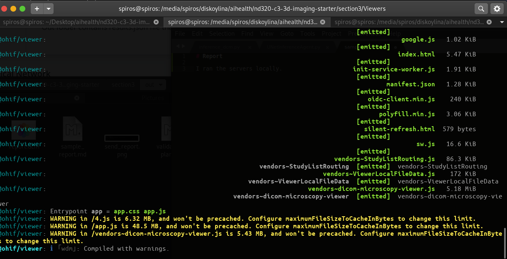
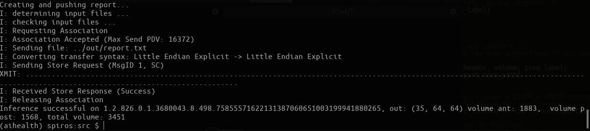
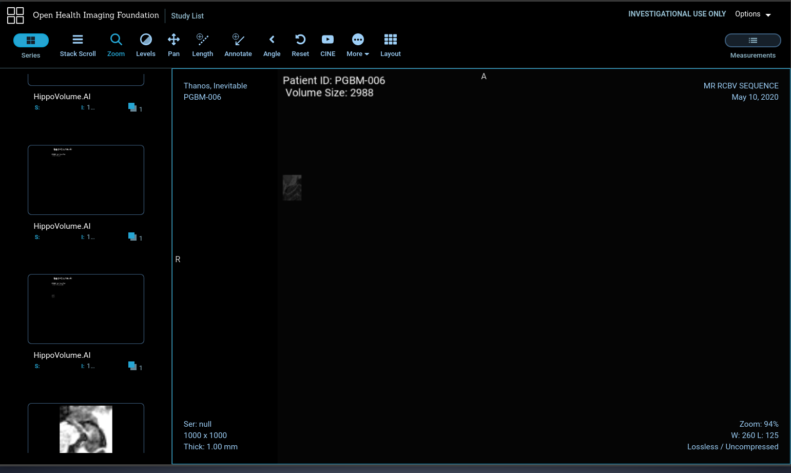
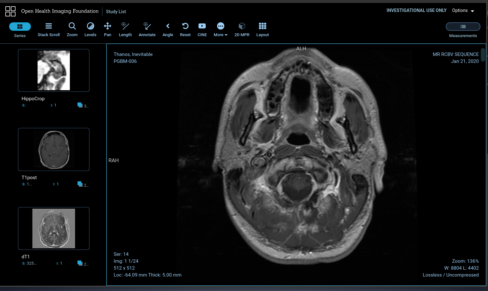

# Report

I ran the servers locally:

OHIF Viewer (`Viewers` folder):

`yarn run orthanc:up`

and in another terminal window(`Viewers` folder):

`yarn run dev:orthanc`



Executed the `lua` script as:

```
curl -X POST http://localhost:8042/tools/execute-script --data-binary @route_dicoms.lua
```

Then I uploaded the 3 studies to the viewer using one of the scripts:

```
storescu 127.0.0.1 4242 -v -aec HIPPOAI +r +sd ../../../data/TestVolumes/Study1
```


Because the starter code didn't read all the folders and I didn't want to change it, I created a new folder
with the hippocampus data from one of the studies and copied it into the main `data` folder.

The project can be run as:

```
python inference_dcm.py "../../data/TestVolumes/StudyT"
```



The model file should be in 
`../../section2/out/2020-05-09_1653_Basic_unet/model.pth`

and the output file in:
`../out/report.dcm`

The final result is shown as:



